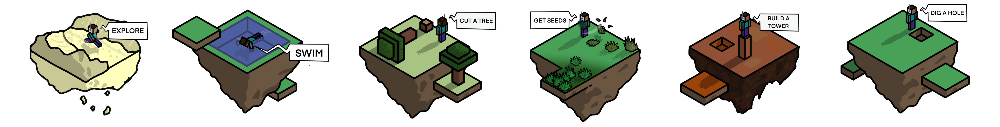

<h2>
  
  STEVE-1: A Generative Model for Text-to-Behavior in Minecraft
</h2>


Shalev Lifshitz*, Keiran Paster*, Harris Chan†, Jimmy Ba, Sheila McIlraith

[Project Page](https://sites.google.com/view/steve-1) | [ArXiv](https://arxiv.org/abs/2306.00937)
| [PDF](https://arxiv.org/pdf/2306.00937.pdf) | Colab (coming soon...)



## Abstract

Constructing AI models that respond to text instructions is challenging, especially for sequential decision-making tasks. This work introduces an instruction-tuned Video Pretraining (VPT) model for Minecraft called STEVE-1, demonstrating that the unCLIP approach, utilized in DALL•E 2, is also effective for creating instruction-following sequential decision-making agents. STEVE-1 is trained in two steps: adapting the pretrained VPT model to follow commands in MineCLIP's latent space, then training a prior to predict latent codes from text. This allows us to finetune VPT through self-supervised behavioral cloning and hindsight relabeling, bypassing the need for costly human text annotations. By leveraging pretrained models like VPT and MineCLIP and employing best practices from text-conditioned image generation, STEVE-1 **costs just $60 to train and can follow a wide range of short-horizon open-ended text and visual instructions in Minecraft**. STEVE-1 sets a new bar for open-ended instruction following in Minecraft with low-level controls (mouse and keyboard) and raw pixel inputs, far outperforming previous baselines. We provide experimental evidence highlighting key factors for downstream performance, including pretraining, classifier-free guidance, and data scaling. All resources, including our model weights, training scripts, and evaluation tools are made available for further research.

### Directory Structure:

```
.
├── README.md
├── steve1
│   ├── All agent, dataset, and training code.
├── run_agent
│   ├── Scripts for running the agent.
├── train
│   ├── Script for training the agent and generating the dataset.

```
# Try STEVE-1

## Setup

### Install the environment

We recommend running on linux using a conda environment, with python 3.10.

1. Install PyTorch 2.0: `conda install pytorch torchvision torchaudio pytorch-cuda=11.7 -c pytorch -c nvidia`
2. Install MineDojo and MineCLIP: `pip install minedojo git+https://github.com/MineDojo/MineCLIP`
   - See [MineDojo Installation](https://docs.minedojo.org/sections/getting_started/install.html) for more details such as setting the correct Java version
3. Install MineRL: `pip install git+https://github.com/minerllabs/minerl@v1.0.1`
   - See [MineRL Installation](https://minerl.readthedocs.io/en/latest/tutorials/index.html) for more details on how to setup MineRL
4. Install VPT requirements: `pip install gym==0.19 gym3 attrs opencv-python`
5. Install additional requirements: `pip install gdown tqdm accelerate==0.18.0 wandb`
6. Install `steve1` locally with: `pip install -e .`

### Running on a headless server

If you are running on a headless server, you need to install `xvfb` 
and run each python script with `xvfb-run`. For example, `xvfb-run python script_name.py`. 

Also, notice that we use the MineRL environment, not the MineDojo environment. Thus, setting 
`MINEDOJO_HEADLESS=1` as mentioned in the 'MineDojo Installation' instructions will have no effect.

### Download the data and weights

Run the following command to download the data and weights:

```
. download_weights.sh
```

## Training
 
To train STEVE-1 from scratch, please run the following steps:

1. Generate the gameplay dataset by running: `. train/1_generate_dataset.sh`
2. Create a sampling (train/val split) by running: `. train/2_create_sampling.sh`
3. Train the agent by running: `. train/3_train.sh`
4. Train the prior CVAE by running: `. train/4_train_prior.sh`

## Generating Gameplay Videos

We provided two scripts for testing out the agent with different prompts. To test out your own trained agents, please modify the `--in_weights` argument in the scripts.

1. Run: `. run_agent/1_gen_paper_videos.sh` to generate the videos used in the paper.
2. Run: `. run_agent/2_gen_vid_for_text_prompt.sh` to generate videos for arbitrary text prompts.
3. Run: `. run_agent/3_run_interactive_session.sh` to start an interactive session with STEVE-1. This will not work in headless mode.

## Paper Citation

Please cite our paper if you find STEVE-1 useful for your research:
```
@article{lifshitz2023steve1,
      title={STEVE-1: A Generative Model for Text-to-Behavior in Minecraft}, 
      author={Shalev Lifshitz and Keiran Paster and Harris Chan and Jimmy Ba and Sheila McIlraith},
      year={2023},
      eprint={2306.00937},
      archivePrefix={arXiv},
      primaryClass={cs.LG}
}
```
